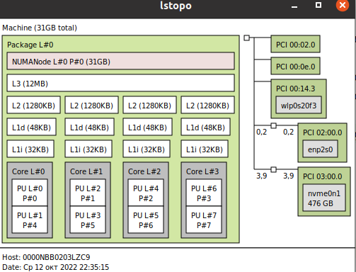

# Задание 3. Практика: эксперименты с экзекьюторами
 
_1. Напишите число ядер вашего компьютера_

nproc говорит мне, что ядер 8, и Runtime.getRuntime().availableProcessors() говорит мне, что 
ядер 8. Если копнуть поглубже и сказать что-то вроде
```shell
sudo apt-get install hwloc
lstopo
```
то видно, что это все-таки hyper-threading



_2. Поставьте в LoadGenerator метод sleep и поэкспериментируйте с экзекьютором в классе ReportServiceExecutors. Попробуйте разные виды и параметры, запишите время выполнения теста при разных вариантах_

_3. Поставьте в LoadGenerator метод compute и поэкспериментируйте с экзекьютором в классе ReportServiceExecutors. Запишите время выполнения теста при разных вариантах_

_4. Проанализируйте полученные цифры и напишите свои выводы и впечатления:)_

(приложите, пожалуйста, результаты из пунктов 2 и 3)


| Executor                           | LoadGenerator | Execution time |
|------------------------------------|---------------|----------------|
| Executors.newCachedThreadPool()    | compute       | 35276          |
| Executors.newFixedThreadPool(4)    | compute       | 42074          |
| Executors.newFixedThreadPool(8)    | compute       | 34623          |
| Executors.newFixedThreadPool(16)   | compute       | 24006          |
| Executors.newFixedThreadPool(24)   | compute       | 37772          |
| Executors.newFixedThreadPool(32)   | compute       | 38333          |
| Executors.newFixedThreadPool(64)   | compute       | 35122          |
| Executors.newFixedThreadPool(128)  | compute       | 38346          |
| Executors.newFixedThreadPool(256)  | compute       | 34769          |
| Executors.newWorkStealingPool(4)   | compute       | 37139          |
| Executors.newWorkStealingPool()    | compute       | 38057          |
| Executors.newWorkStealingPool(24)  | compute       | 35542          |
| Executors.newWorkStealingPool(32)  | compute       | 39555          |
| Executors.newWorkStealingPool(64)  | compute       | 36925          |
| Executors.newWorkStealingPool(128) | compute       | 38193          |
| Executors.newCachedThreadPool()    | sleep         | 15023          |
| Executors.newFixedThreadPool(4)    | sleep         | 136524         |
| Executors.newFixedThreadPool(8)    | sleep         | 69016          |
| Executors.newFixedThreadPool(16)   | sleep         | 36013          |
| Executors.newFixedThreadPool(24)   | sleep         | 24011          |
| Executors.newFixedThreadPool(32)   | sleep         | 19508          |
| Executors.newFixedThreadPool(64)   | sleep         | 15022          |
| Executors.newFixedThreadPool(128)  | sleep         | 15022          |
| Executors.newFixedThreadPool(256)  | sleep         | 15042          |
| Executors.newWorkStealingPool(4)   | sleep         | 136537         |
| Executors.newWorkStealingPool()    | sleep         | 69020          |
| Executors.newWorkStealingPool(24)  | sleep         | 24011          |
| Executors.newWorkStealingPool(32)  | sleep         | 19539          |
| Executors.newWorkStealingPool(64)  | sleep         | 15022          |
| Executors.newWorkStealingPool(128) | sleep         | 15021          |

Вот табличка с результатами испытаний.

Выводы и впечатления - 

1) для compute самый лучший результат показал newFixedThreadPool с числом потоков, равным удвоенному числу ядер, самый худший - Executors.newFixedThreadPool с числом потоков, в половину меньше числа ядер.
2) для sleep самые лучшие результаты показали Executors.newFixedThreadPool и Executors.newWorkStealingPool с числом потоков, в 8 раз большим числа ядер, самый худший результат - Executors.newFixedThreadPool и Executors.newWorkStealingPool с числом потоков, в 2 раза меньшим числа ядер.

Получается, что
1) Hyper-Threading реально работает :-)
2) Что не делай, но если потоков меньше, чем число ядер - дело плохо
3) При "честных" вычислениях (compute, RUNNABLE для потока) слишком сильно увеличивать число потоков не стоит, реального выигрыша не будет
4) А при блокирующих вызовах (sleep, WAITING для потока) число потоков надо бы взять поболее (хотя после какого-то предела выигрыш будет слишком маленький, а то его и вообще не будет)

## Update - обратная связь от преподавателя

> Всё правильно, немного дополню про размер пула для блокирующих вызовов. Тут действительно, чем больше потоков, тем выше шанс у процессора получить какую-нибудь работу и сделать больше добрых дел в единицу времени

> Многие делают вывод, что для таких случаев самый оптимальный выбор - это cached экзекьютор. Но каждый новый поток - это около 1 мб, и лучше всё же поставить верхний лимит, чтобы избежать ООМ