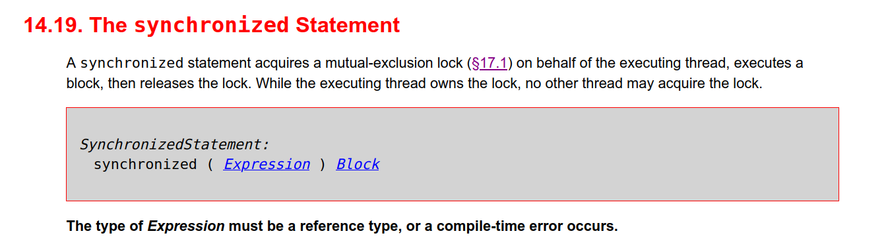

# Задание 2. Практика: объекты и мониторы

Двум потокам доступен следующий код:

```java
public class Scratch {

    Set<Integer> set = new HashSet<>();

    public void update() {
        synchronized (set) {
           // ... T1 stop
        }
    }

    public void clear() {
        set.clear();
    }
}        
```

Поток Т1 зашёл в метод ```update``` до момента T1 ```stop```

В это время поток Т2 вызвал метод ```clear```

## Отметьте верные для этой ситуации утверждения:

### Поток T2 заблокируется, пока поток T1 не выйдет из метода update

Нет, он не будет заблокирован - нет причин, он не в блоке ```syncronyzed``` по ```set```

### T2 спокойно выполнит clear

Да, совершенно верно - спокойно выполнит, нет причин для блокировки

### В потоке Т1 выбросится ConcurrentModificationException

Нет никаких причин для выбрасывания этого исключения - нет обращения к элементам

### В потоке Т1 выбросится RuntimeException

Нет никаких причин для выбрасывания этого исключения

### Будет ошибка компиляции, так как нельзя синхронизироваться по интерфейсу

Нет ограничений на интерфейс, спека учит нас, что достаточно reference type:



[The type of Expression must be a reference type, or a compile-time error occurs.](https://docs.oracle.com/javase/specs/jls/se8/html/jls-14.html#jls-14.19)