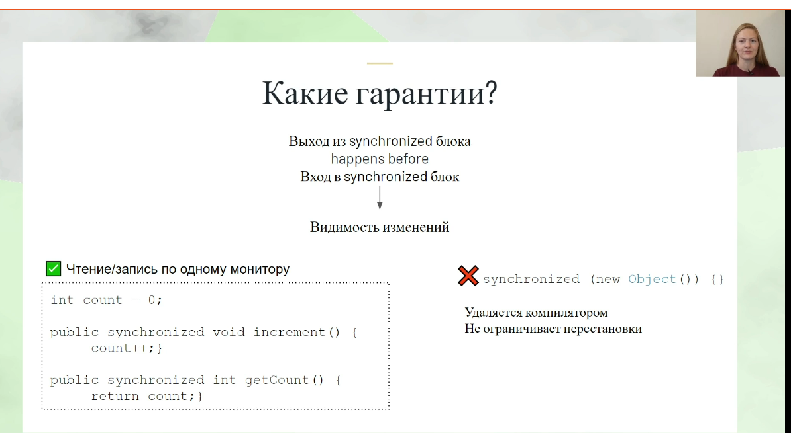

# Задание 3. Практика: объекты и мониторы 2

Перед вами код:

```java
class Scratch {
    private int value = 0;
    private final Object readLock = new Object();
    private final Object writeLock = new Object();

    public int read() {
        synchronized (readLock) {
            return value;
        }
    }

    public void update(int value) {
        synchronized (writeLock) {
            this.value = value++;
        }
    }
}
```

## Какое максимальное количество потоков могут одновременно работать с переменной value? (работать = читать или обновлять)

Два объекта для синхронизации, ```readLock``` и ```writeLock``` - два потока могут одновременно работать с переменной value.
На чтение блок синхронизации по ```readLock``` пустят один поток, на запись блок синхронизации по другому объекту ```writeLock``` 
пустят второй поток.

## Какие ошибки возможны в этом коде?

Безотносительно многопоточности - непонятно, чего хотели достичь инкрементом ```value``` в строке
```
this.value = value++;
```

Значение this.value изменится на value из аргумента метода, а инкремент аргумента метода value 
уйдет в никуда - параметры передаются по значению, и это изменнное значение никто не увидит и никто не обработает.

Относительно многопоточности - надо бы было один объект ставить, одинаковый, иначе цели синхронизации не достигаются.

При чтении в ```read``` мы можем не увидеть изменений, которые были сделаны в методе ```write```.

Это задание, видимо, иллюстрация к этому слайду из лекции



Блоки синхронизации по разным объектам - и JMM не дает нам никаких гарантий на взаимодействие записи и чтения.